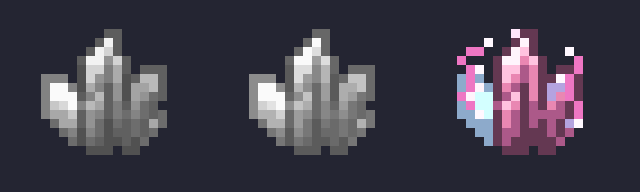
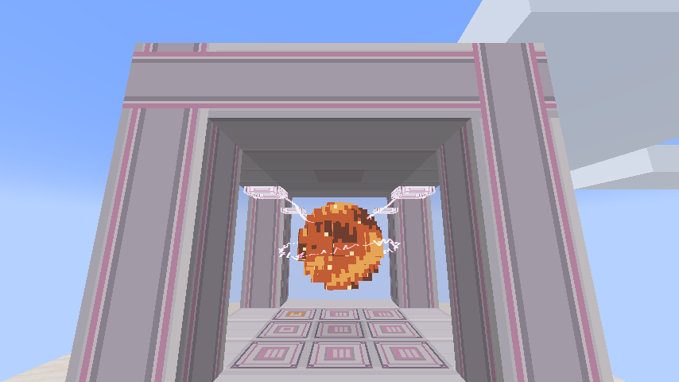

# 闪电科技：模拟

[English](README.en.md) · [更新记录](CHANGELOG.md) · [许可范围](LICENSES.md)

作者：**qiqi**。为 **Minecraft 1.21.1 / NeoForge** 制作的 AE2 Lightning Tech Reborn 附属模组，用雷击培养可重复使用的模拟水晶，通过 ME 网络生产矿物、作物、木材和生物战利品。

当前版本：**0.1.1-beta.2**。本次兼容迁回 CurseForge 主项目的新版前置；保留已有玩法、注册 ID 与存档数据。属于 Beta 测试版本。



## 安装

需要 **Java 21**，客户端与服务器安装同一版本。将本模组的普通 JAR 放入游戏实例的 `mods/`，并安装下表前置。升级时先备份存档、移走旧版附属模组，避免重复加载；`sources.jar` 和源码 ZIP 用于开发，不放入 `mods/`。

| 必需组件 | 支持版本 |
| --- | --- |
| Minecraft | 1.21.1 |
| NeoForge | 21.1.252～21.1.x |
| Applied Energistics 2 | 19.2.17 |
| AE2 Lightning Tech / Reborn | 2.1.0～2.1.1 |
| Thunderbolt Core / Reborn | 2.0.0～2.0.2 |
| GuideME | 21.1.19 |

推荐安装 [AE2 Lightning Tech 2.1.1](https://www.curseforge.com/minecraft/mc-mods/ae2-lightning-tech/files/9024605) 与 [Thunderbolt Core 2.0.2](https://www.curseforge.com/minecraft/mc-mods/thunderbolt-core/files/9055479)，或保留原 Reborn 2.1.0 / 2.0.0 组合。Reborn 已迁回上述主项目；内部 mod ID 仍是 `ae2lt` / `thunderbolt`，不要同时安装两份同 ID 的前置。

只装 AE2、GuideME 和本附属模组仍会报缺少前置，必须另行安装闪电科技与 Thunderbolt。2.0.x 的早期闪电科技不在本版支持范围内。Mekanism 为可选兼容模组，已验证 10.7.19.85；Mystical Agriculture / Cucumber 为可选作物兼容测试环境，已验证 8.0.28 / 8.0.16。测试组合和构建命令见 [兼容说明](docs/curseforge-compatibility.md)。

本项目不分发 Minecraft 本体或前置模组。固定的开发依赖下载地址及 SHA-256 见 [依赖清单](scripts/dependencies.json)。

## 主要玩法

- **模拟水晶**：空白 → 记录模拟对象 → 额外培养 10 次雷击 → 完美水晶。接受自然、人工和指令雷击；数据包可以限制雷击类型。完美水晶作为模板反复使用。
- **材料绑定**：在闪电收集器所在高度的水平 5×5 区域摆放同种材料，中心除外，共 24 格。矿物使用粗矿块，钻石等使用储存块；作物种在相同高度的耕地上方，树苗种在泥土类方块上方。收集器受雷后消耗材料或植株，保留土壤。
- **生物绑定**：副手持空白水晶被雷击时，有 **33%** 概率记录半径 5 格内最近的适用生物；创造模式可用，通常支持具有刷怪蛋的模组生物。凋零、末影龙和坚守者使用专门掉落规则。
- **过载模拟室**：单方块机器，通过闪电坍缩矩阵扩展至 128 并行，支持四张加速卡、自动弹出、过载频率及持续从 AE 网络充入 FE。每次操作消耗高压闪电。
- **多方块模拟室**：外尺寸 3×3×3～7×7×7，分别容纳 9 / 16 / 25 / 36 / 49 个完美水晶。框架构成边框与顶面，四面聚能石英玻璃，底部放框架或模块；控制器和可选过载 ME 接口位于底部非角边框。
- 多方块基础周期 **180 tick**，每个参加生产的水晶消耗 **1000 FE + 1 高压闪电**。效率模块最多减少 104 tick，时运最多 ×1024；过载模块额外消耗 1 极高压并将周期减半；熔炼模块额外消耗 2 高压，粗矿或远古残骸转为双倍熔炼结果。费用在完成时结算，随时取放水晶会取消当前批次且不收费。
- 多方块拥有 **128 个输出缓冲格，每格最多 1024 件**，分页显示；提取时恢复正常物品堆叠。成型结构的过载接口可将产物送入 AE，不能接收的保留在缓冲。
- **过载雷鸣线圈**：在过载装备工作站安装过载核心、模块并绑定网络。短按右键松开劈目标，蓄力 1.5 秒松开劈自己；默认 10 高压产生人工雷，极高压模块启用后 10 极高压产生自然雷。
- 线圈支持拟态挖掘、终极破坏、效率 X、时运 V、精准采集、T1/T2/T3 能量模块及扳手模块。扳手模式支持 AE2 和可选 Mekanism 配置器，**Shift＋滚轮**切换用途。

物品上长按 **G** 打开指南；手持线圈按 G 进入闪电科技设备配置。完整材料与制造费用见 [18 项制造配方](docs/manufacturing-recipes.md)。



## 给整合包和附属模组作者

支持数据包配方、公共标签、输出提供器和可取消 Java 事件；不直接依赖 KubeJS。具体接口和示例：

- [数据包与 Java API](docs/api.md)
- [矿物、生物与通用适配](docs/compatibility-api.md)
- [耕地作物与神秘农业适配](docs/crop-compatibility-api.md)
- [多方块结构、升级和结算](docs/multiblock-api.md)

显式配方优先于自动识别。通用适配不会复制生物装备/个体 NBT、来源耕地等级、crux 或植株方块实体；特殊内容可以用上述 API 覆盖。AE2 支持模板和物流，目前尚未实现原生 AE2 CPU 按需自动合成接口。

## 从源码构建

使用 Java **21 JDK**；发布检查脚本需要 Python **3.11 或以上**。Gradle 8.8 由仓库内 Wrapper 下载并校验。脚本不要求特定盘符。开发依赖放在忽略的 `libs/`，不会捆绑进发布 JAR。

Windows PowerShell：

```powershell
.\scripts\bootstrap.ps1
.\gradlew.bat verifyReleaseVersion build runGameTestServer --no-daemon
python .\scripts\verify-release.py
```

Linux / macOS（需要 PowerShell 7 的 `pwsh` 来下载开发依赖）：

```bash
pwsh -File scripts/bootstrap.ps1
chmod +x gradlew
./gradlew verifyReleaseVersion build runGameTestServer --no-daemon
python3 scripts/verify-release.py
```

也可以执行 `scripts/build.ps1 -GameTests`，或使用 `-Client` 启动开发客户端。产物位于 `build/libs/`；版本唯一来源为 `gradle.properties` 的 `mod_version`。贡献和可选兼容测试见 [CONTRIBUTING.md](CONTRIBUTING.md)。

## 美术与许可

Blockbench 分层工程保存在 [art/](art/)，完美模拟水晶用作模组标志。水晶和七个模块图标改编自 AE2 Lightning Tech Reborn 的素材，保留 **CC BY-NC-SA 3.0**；代码、文档及原创模型和电弧使用 **MIT**。出处、修改说明及范围见 [THIRD_PARTY_NOTICES.md](THIRD_PARTY_NOTICES.md) 和 [LICENSES.md](LICENSES.md)。这是独立附属项目。

## 反馈与测试范围

报告问题时提供游戏/加载器/前置版本、复现步骤和 `latest.log` 或崩溃报告；仓库提供中英双语反馈模板。历史验收见 [验证记录](docs/verification.md)。长期存档、多人环境及更多第三方模组仍需要进一步联调。
